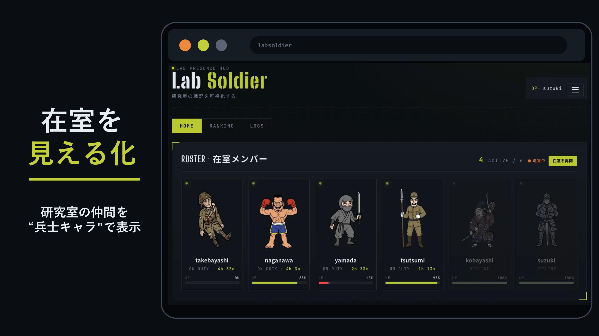
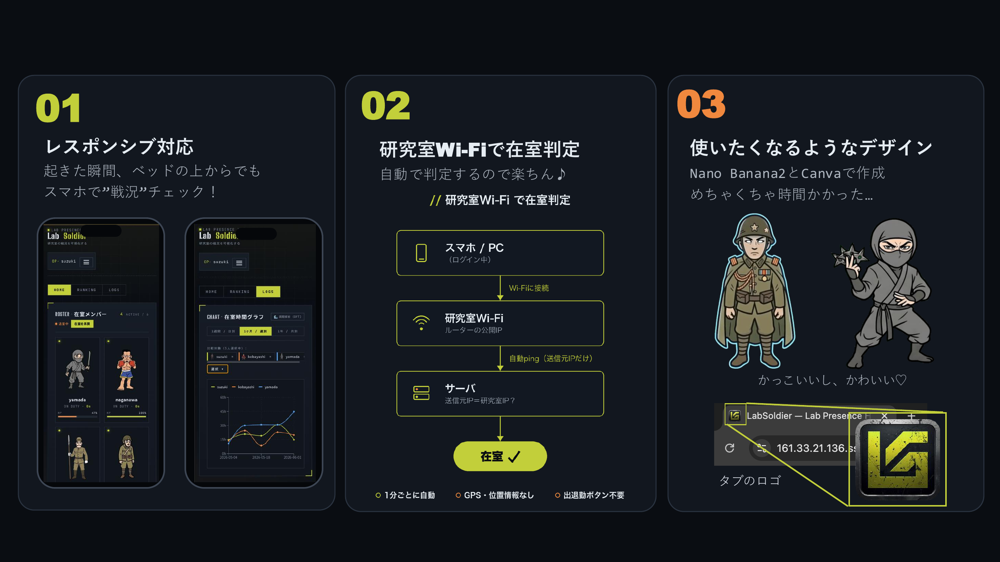
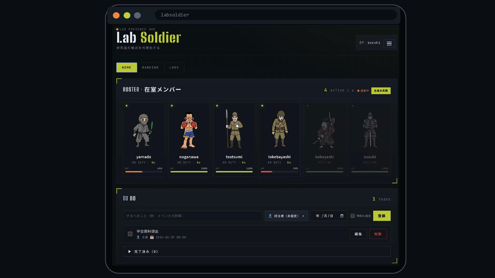
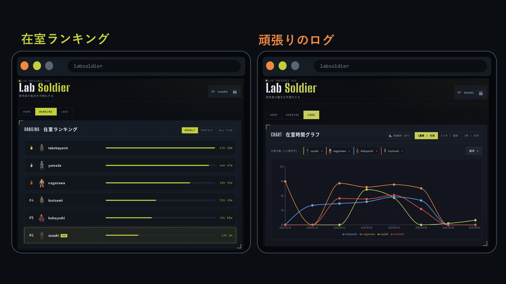
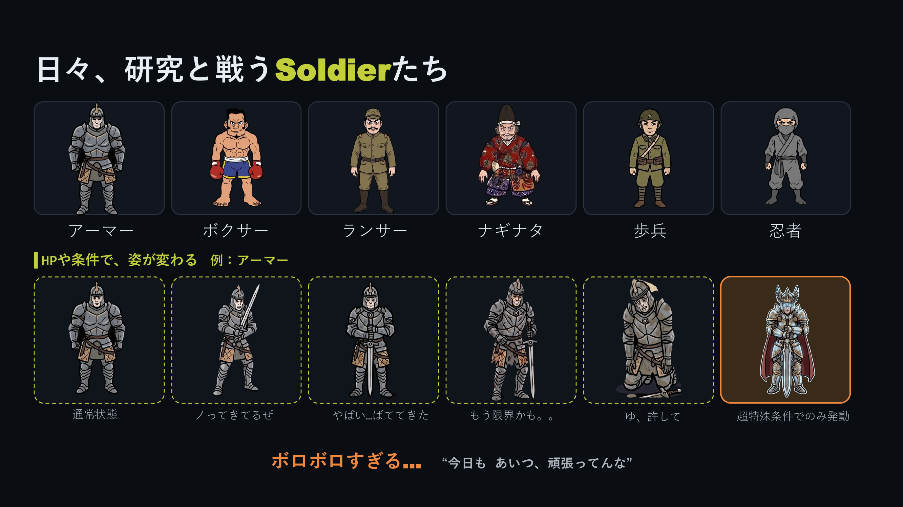
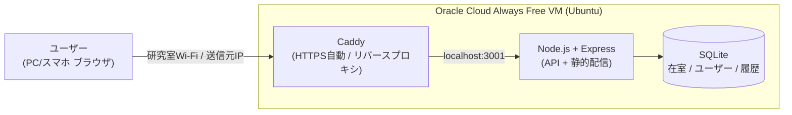
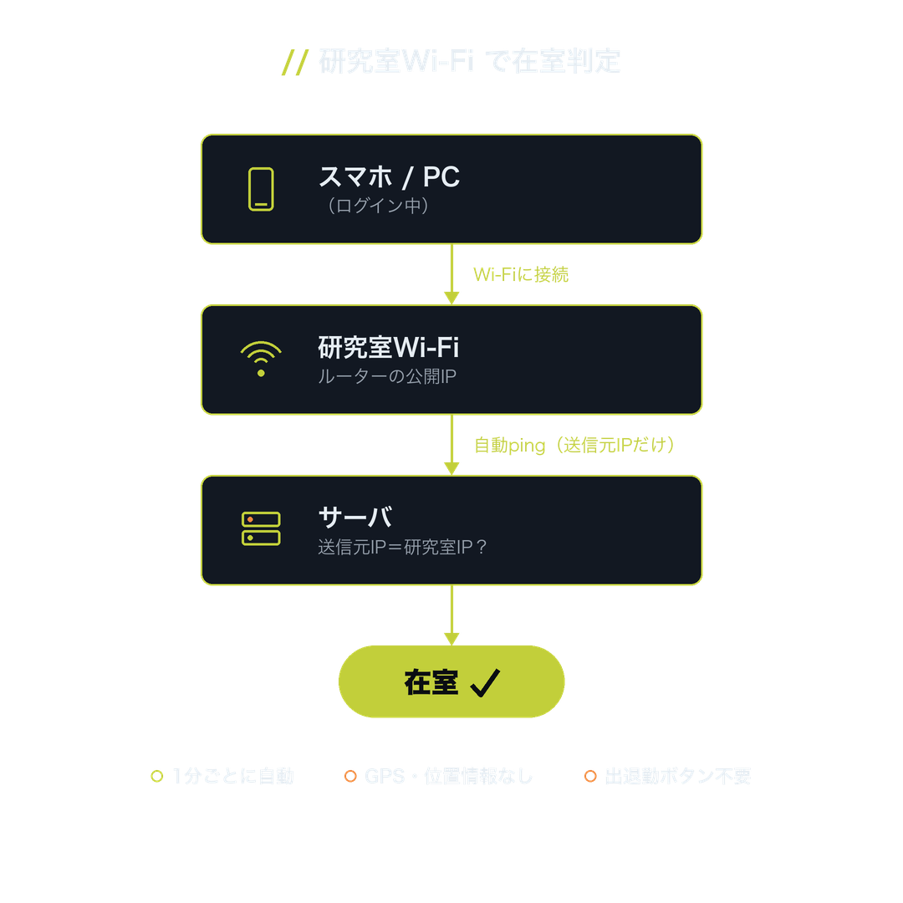
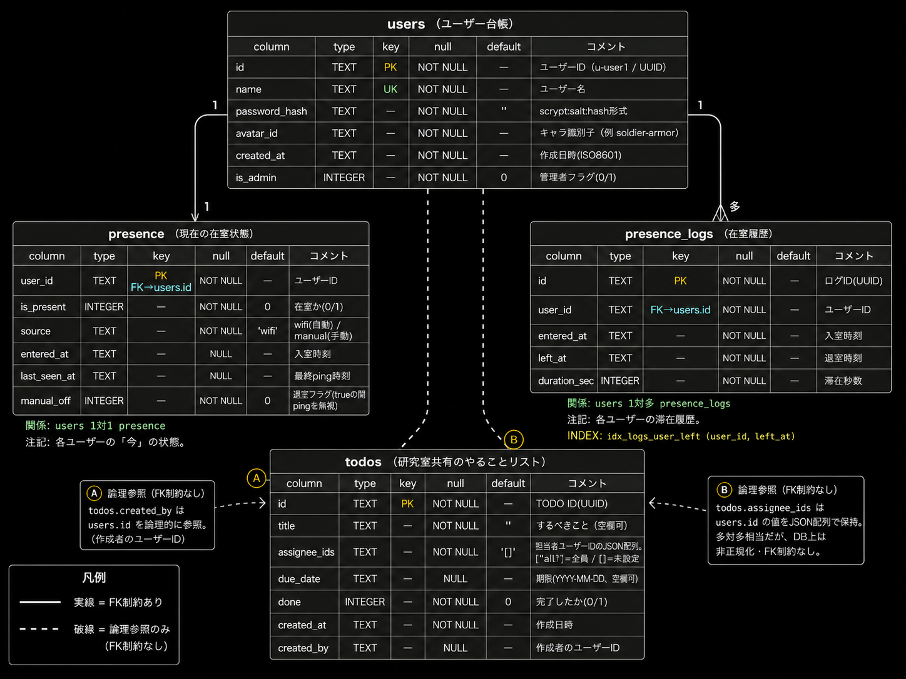

 研究室の在室"戦況"を見える化するシステム ― LabSoldier
================================================================

### 研究室の「いま、だれかいる？」を兵士キャラで自動可視化するデジタル在室ボード。Wi‑Fiにつなぐだけで在室判定し、長く居るほどソルジャーが疲れていく。

---

## これは何？

「研究室、今だれかいる？」——その一言を送る前に、画面を見れば分かる。
LabSoldier は、研究室にいるメンバーを **兵士キャラクター** で一覧表示する、デジタル版の "在室ボード"（今だれが部屋にいるかを示す掲示板）です。研究は長期戦——日々それに立ち向かうメンバーを、戦場で戦う **"兵士（Soldier）"** に見立てたのが、アプリ名の由来です。

- 操作は不要。**研究室のWi‑Fiにつながると自動で「在室」** に切り替わります。
- 長く居るほどキャラの体力（HP）が減って見た目が疲れていくので、**頑張り（こもった時間）がそのまま姿に表れます**。よく通う人はランキング上位に。
- 「誰かいる」と分かるだけで研究室に行く理由になり、無駄足も減ります。

<div align="center">



</div>

---

## 背景・モチベーション

研究室には、よくある2つの困りごとがあります。

1. **誰がいるのか分からない。** 行ってみたら誰もいなかった、「今いる？」とLINEで確認し合う——そんな無駄足や手間が積み重なります。
2. **一人だと足が向かない。** でも「誰かいる」と分かれば、研究室に行く気になれます。

LabSoldier は、この2つを「**今、研究室に誰がいるか**」をひと目で分かるようにして解決します。在室しているかどうかは自動で判定されるので、面倒な操作は一切不要。昔ながらの「在室ボード」を、もっと楽しく・もっと自動にしたもの——そんなイメージです。

<div align="center">


</div>

---

## 主な機能

| 機能 | 説明 |
|---|---|
| **Wi‑Fiで自動在室判定** | クライアントの送信元IPが研究室のものかをサーバーで照合。チェックイン操作は不要。GPS・位置情報は一切使わない。 |
| **育って疲れるソルジャー** | 在室すると消耗し、不在だと回復する HP を持ち、HP・在室状況に応じて見た目が **6段階** に変化（元気→気合い十分→夜更かし→疲労→ダウン→...）。アバターは6種類。 |
| **在室ランキング** | 週／月／全期間の在室時間ランキング。「誰が一番こもっているか」が一目で分かる。 |
| **在室ログ＆グラフ** | 在室履歴を折れ線グラフで可視化。誰がいつ在室していたかを振り返れる。 |
| **やることリスト** | 研究室共有のTODO。担当者（在室メンバーから複数選択）・期限つき。 |
| **PWA対応** | スマホのホーム画面に追加してアプリのように使える。 |
| **管理者機能** | ユーザー管理・在室ログの追加/削除など。 |
| **手動チェックイン/退室** | 自動判定に加え、明示的な退室・復帰も可能。 |

<div align="center">



</div>

---

## 画面紹介

<div align="center">



<br/><br/>



</div>

---

## ソルジャーたち

アバターは6種類（アーマー・ボクサー・ランサー・ナギナタ・歩兵・忍者）。
在室時間とHPに応じて、それぞれが少しずつ疲れていきます（例：アーマーの段階変化）。

<div align="center">



</div>

---

## アーキテクチャ



- **フロント**: React + TypeScript（Vite / PWA）。ビルド成果物は Caddy/Express が同一オリジンで配信。
- **在室判定**: 届いた送信元IPが研究室の公開IPと一致するかで判定（＝GPS不使用）。
- **永続データ**: SQLite の DB ファイルは再デプロイの同期対象外ディレクトリに置き、コード更新で消えないよう分離。
- ER図は [`docs/er-diagram.png`](docs/er-diagram.png)、詳細仕様は [`docs/SPEC.md`](docs/SPEC.md) を参照。

---

## 在室判定のしくみ

操作は一切不要。ブラウザを開いておくだけで、1分ごとにサーバーが「送信元IPが研究室のものか」だけを見て在室を判定します。

<div align="center">



</div>

1. フロントが**ログイン中1分ごと**に `POST /api/presence/ping`（[`frontend/src/hooks/usePresencePing.ts`](frontend/src/hooks/usePresencePing.ts)）
2. バックエンドが**送信元IP**を取得（`x-forwarded-for` 優先＝Caddy越し対応）
3. 環境変数 `LAB_ALLOWED_IPS`（カンマ区切り）に含まれれば在室、なければ不在
4. 直近の ping 状況から、表示用に **3状態** を判定（[`backend/src/lib/judge.ts`](backend/src/lib/judge.ts)）

| status | 条件 |
| :--- | :--- |
| `present` | 退室フラグなし & 5分以内に ping & 在室 |
| `unknown` | 5〜30分 ping なし（離席かも） |
| `absent` | 30分以上 ping なし / 退室フラグON / 初期状態 |

> 「退室する」を押すと `manual_off=true` になり以降の ping を無視（勝手に在室復帰しない）。「在室を再開」で自動判定に戻ります。

---

## 技術スタック

| カテゴリ | 技術 |
| --- | --- |
| フレームワーク | React 18, TypeScript |
| ビルド / 開発サーバー | Vite 5 |
| PWA | vite-plugin-pwa（Service Worker / ホーム画面追加） |
| グラフ | Recharts |
| バックエンド | Node.js 20, Express 4, TypeScript（tsx） |
| データベース | SQLite（better-sqlite3 / 同期API） |
| 認証 | 自前JWT（HS256署名・7日有効）+ scrypt（Node標準 crypto） |
| ホスティング | Oracle Cloud Always Free VM（Ubuntu 22.04 / 1 OCPU / 1GB） |
| プロセス管理 | systemd（常駐・自動再起動） |
| HTTPS / リバースプロキシ | Caddy 2（Let's Encrypt 自動取得） |
| DNS | sslip.io（`<IP>.sslip.io` で独自ドメイン不要） |

---

## データモデル

SQLite の3テーブル。`users` を中心に、`presence`（現在の状態・1対1）と `presence_logs`（在室履歴・1対多）で構成します。ランキングと HP はすべて `presence_logs` から算出します。

| テーブル | 役割 | 主なカラム |
| --- | --- | --- |
| `users` | ユーザー台帳 | `id` / `name` / `password_hash`（scrypt）/ `avatar_id` |
| `presence` | 各ユーザーの「今」の状態（1人1行） | `is_present` / `source`（wifi/manual）/ `entered_at` / `last_seen_at` / `manual_off` |
| `presence_logs` | 滞在ごとの履歴（1滞在1行） | `user_id` / `entered_at` / `left_at` / `duration_sec` |

<div align="center">



</div>

詳細は [`docs/SPEC.md`](docs/SPEC.md) を参照。

---

## ディレクトリ構成

```
.
├── frontend/        # React + TypeScript (Vite / PWA)
│   ├── src/         # 画面・コンポーネント・APIクライアント
│   └── public/      # アイコン・キャラGIF (avatars/<id>/<id>_1..6.gif)
├── backend/         # Node.js + Express + SQLite
│   └── src/         # routes / lib(HP・stage・judge) / db / middleware
├── deploy/          # Caddyfile / systemd unit / セットアップ・再デプロイ スクリプト
├── docs/            # 仕様書(SPEC.md) / ER図 / バックエンド構成 / スクリーンショット
└── README.md
```

---

## セットアップ（ローカル開発）

前提: **Node.js 20+** / **npm 10+**

```bash
# 1) バックエンド（http://localhost:3001）
cd backend
npm install
npm run dev

# 2) フロントエンド（http://localhost:5173） ※別ターミナル
cd frontend
npm install
npm run dev
```

ブラウザで http://localhost:5173 を開く。開発用の初期アカウント（`user1` 等 / パスワードは開発用デフォルト）でログインできます。環境変数は [`backend/.env.example`](backend/.env.example) を参照してください。

ビルド:

```bash
cd backend  && npm run build && npm start   # 本番起動
cd frontend && npm run build                # 静的成果物を生成
```

---

## 本番デプロイ（概要）

無料の Oracle Cloud Always Free VM 1台に、HTTPS まで自前で構築する想定です。

1. VM 初期セットアップ（Node.js / ビルド / systemd 登録）: [`deploy/setup.sh`](deploy/setup.sh)
2. リバースプロキシ＋自動HTTPS: [`deploy/Caddyfile`](deploy/Caddyfile)（`sslip.io` でドメイン購入不要）
3. 常駐化: [`deploy/labsoldier.service`](deploy/labsoldier.service)（systemd）
4. 更新デプロイ: [`deploy/redeploy.sh`](deploy/redeploy.sh)（`VM_IP` / `SSH_KEY` を環境変数で指定）

環境変数テンプレートは [`deploy/labsoldier.env.example`](deploy/labsoldier.env.example)。**永続データ（DB・env）は同期対象外のディレクトリに置き**、コード再デプロイ（`rsync --delete`）で消えないようにしています。
