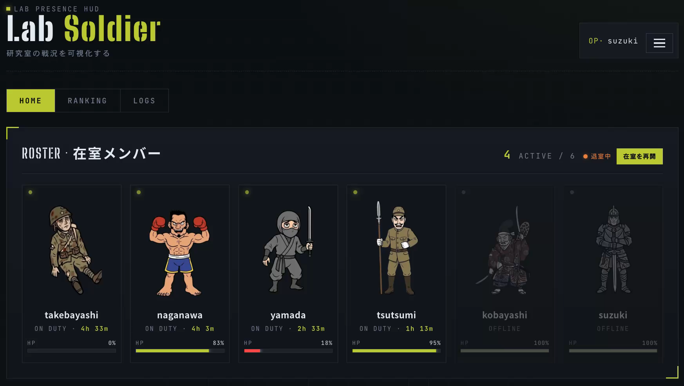
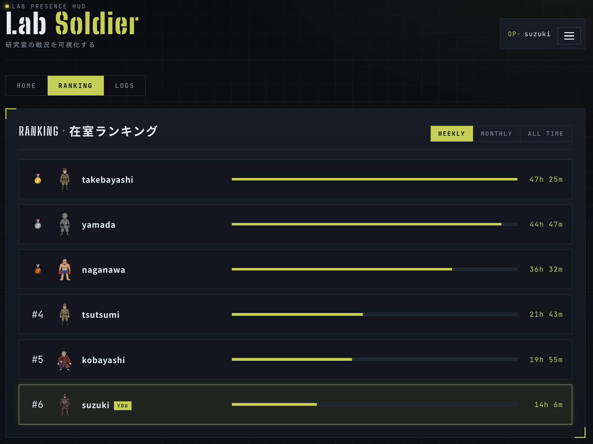
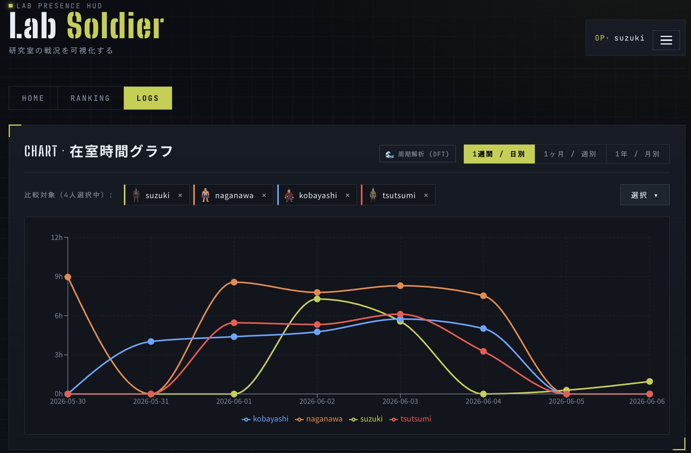
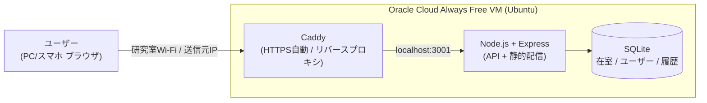

<div align="center">

# 🪖 LabSoldier

**研究室の「いま、だれかいる？」を、兵士キャラで見える化するデジタル在室ボード**

[](LICENSE)


</div>

> **TL;DR (English)** — LabSoldier visualizes who is currently in the lab as little soldier characters. Presence is detected automatically from **whether your device is on the lab Wi‑Fi** — no GPS, no location data. The longer you stay, the more your soldier wears out (an HP that drains while present and heals while away), and a ranking shows who logs the most hours. Built as a PWA with React + TypeScript on the front and Node.js + Express + SQLite on the back, deployed to a free Oracle Cloud VM behind Caddy (auto‑HTTPS).

---

## 📖 これは何？

「研究室、今だれかいる？」——その一言を送る前に、画面を見れば分かる。
LabSoldier は、研究室にいるメンバーを **兵士キャラクター** で一覧表示する、デジタル版の "在室ボード（行き先表示板）" です。

- 操作は不要。**研究室のWi‑Fiにつながると自動で「在室」** に切り替わります。
- 長く居るほどキャラは少しずつ疲れていき（HP）、よく来る人がランキング上位に。
- 「誰かいる」が見えるだけで、研究室に行く理由になる。無駄足も減る。

<!-- スクリーンショットは docs/screenshots/ に配置すると表示されます -->
<div align="center">

| ホーム | ランキング | 在室ログ |
|:---:|:---:|:---:|
|  |  |  |

</div>

---

## 💡 背景・モチベーション

研究室には2つの "もったいない" があります。

1. **誰がいるか分からない** → 行ってみたら無人、確認のLINEが飛び交う、無駄足が増える。
2. **ひとりだと行く気が起きない** → でも「誰かいる」と分かれば行動は変わる。

LabSoldier は「在室しているか／いないか」という**たった1ビット**を、楽しく・自動で可視化することでこの2つを解決します。黒板の行き先表示板を、もっと楽しく・もっと自動にしたもの、と思ってください。

---

## ✨ 主な機能

| 機能 | 説明 |
|---|---|
| 🛜 **Wi‑Fiで自動在室判定** | クライアントの送信元IPが研究室のものかをサーバーで照合。チェックイン操作は不要。GPS・位置情報は一切使わない。 |
| 🪖 **育って疲れるソルジャー** | 在室で消耗し不在で回復する HP を持ち、HP・在室状況に応じて見た目が **6段階** に変化（元気→長時間在室→深夜→疲労→ダウン→…）。アバターは6種類。 |
| 🏆 **在室ランキング** | 週／月／全期間の在室時間ランキング。「誰が一番こもっているか」が一目で分かる。 |
| 📈 **在室ログ＆グラフ** | 在室履歴の折れ線グラフに加え、**離散フーリエ変換(DFT)** で「曜日の周期性（毎週この曜日に来る）」を可視化。 |
| ✅ **やることリスト** | 研究室共有のTODO。担当者（在室メンバーから複数選択）・期限つき。 |
| 📱 **PWA対応** | スマホのホーム画面に追加してアプリのように使える。 |
| 🛠 **管理者機能** | ユーザー管理・在室ログの追加/削除など。 |
| 🚪 **手動チェックイン/退室** | 自動判定に加え、明示的な退室・復帰も可能。 |

---

## 🏗 アーキテクチャ



- **フロント**: React + TypeScript（Vite / PWA）。ビルド成果物は Caddy/Express が同一オリジンで配信。
- **在室判定**: 届いた送信元IPが研究室の公開IPと一致するかで判定（＝GPS不使用）。
- **永続データ**: SQLite の DB ファイルは再デプロイの同期対象外ディレクトリに置き、コード更新で消えないよう分離。
- ER図は [`docs/er-diagram.png`](docs/er-diagram.png)、詳細仕様は [`docs/SPEC.md`](docs/SPEC.md) を参照。

---

## 🧮 HP・見た目のアルゴリズム

キャラの "疲れ具合" は HP（0〜100%）で表現します。

- **消耗**: 在室中は `24時間で 100% → 0%`（約 0.069%/分）でドレイン
- **回復**: 不在中は `10時間で 0% → 100%`（約 0.167%/分）でヒール
- HP は過去の在室ログを古い順に再生して算出（夜間など長い不在で全回復する）

見た目の **段階(1〜6)** は HP を軸に決定します。

| 段階 | 条件 | イメージ |
|:---:|---|---|
| 1 | HP > 50 | 元気 |
| 2 | HP > 50 かつ 連続在室 3時間以上 | 気合い十分 |
| 3 | 0 < HP ≤ 50 かつ 深夜(JST 1:00–4:00)に在室 | 夜更かし |
| 4 | 0 < HP ≤ 50 | 疲労 |
| 5 | HP = 0 | ダウン |
| 6 | HP = 0 が 4時間以上継続して在室 | 限界突破 |

ロジックは [`backend/src/lib/hp.ts`](backend/src/lib/hp.ts) / [`backend/src/lib/stage.ts`](backend/src/lib/stage.ts) / [`backend/src/lib/judge.ts`](backend/src/lib/judge.ts) にあります。

---

## 🧰 技術スタック

| 層 | 使用技術 |
|---|---|
| フロントエンド | React 18, TypeScript, Vite 5, vite-plugin-pwa, Recharts |
| バックエンド | Node.js 20, Express 4, better-sqlite3, TypeScript, tsx |
| 認証 | 自前のトークン認証（Bearer）＋ scrypt パスワードハッシュ |
| インフラ | Oracle Cloud Always Free VM (Ubuntu), Caddy (Let's Encrypt 自動HTTPS / リバースプロキシ), systemd, sslip.io |

---

## 📂 ディレクトリ構成

```
.
├── frontend/        # React + TypeScript (Vite / PWA)
│   ├── src/         # 画面・コンポーネント・APIクライアント
│   └── public/      # アイコン・キャラGIF (avatars/<id>/<id>_1..6.gif)
├── backend/         # Node.js + Express + SQLite
│   └── src/         # routes / lib(HP・stage・judge) / db / middleware
├── deploy/          # Caddyfile / systemd unit / セットアップ・再デプロイ スクリプト
├── docs/            # 仕様書(SPEC.md) / ER図 / バックエンド構成
└── README.md
```

---

## 🚀 セットアップ（ローカル開発）

前提: **Node.js 20+** / **npm 10+**

```bash
# 1) バックエンド（http://localhost:3001）
cd backend
npm install
npm run dev

# 2) フロントエンド（http://localhost:5173） ※別ターミナル
cd frontend
npm install
npm run dev
```

ブラウザで http://localhost:5173 を開く。開発用の初期アカウント（`user1` 等 / パスワードは開発用デフォルト）でログインできます。環境変数は [`backend/.env.example`](backend/.env.example) を参照してください。

ビルド:

```bash
cd backend  && npm run build && npm start   # 本番起動
cd frontend && npm run build                # 静的成果物を生成
```

---

## ☁️ 本番デプロイ（概要）

無料の Oracle Cloud Always Free VM 1台に、HTTPS まで自前で構築する想定です。

1. VM 初期セットアップ（Node.js / ビルド / systemd 登録）: [`deploy/setup.sh`](deploy/setup.sh)
2. リバースプロキシ＋自動HTTPS: [`deploy/Caddyfile`](deploy/Caddyfile)（`sslip.io` でドメイン購入不要）
3. 常駐化: [`deploy/labsoldier.service`](deploy/labsoldier.service)（systemd）
4. 更新デプロイ: [`deploy/redeploy.sh`](deploy/redeploy.sh)（`VM_IP` / `SSH_KEY` を環境変数で指定）

環境変数テンプレートは [`deploy/labsoldier.env.example`](deploy/labsoldier.env.example)。**永続データ（DB・env）は同期対象外のディレクトリに置き**、コード再デプロイ（`rsync --delete`）で消えないようにしています。

---

## 🔒 プライバシー設計

LabSoldier は **位置情報・GPSを一切使いません**。サーバーが見るのは「送信元IPが研究室のWi‑Fiのものか」という1ビットだけ。

- 地図はなく、個人の "居場所" は分かりません。
- 研究室の外にいる間は、誰にも何も見えません。
- "個人を追う" のではなく、"部屋の状況" を見るためのツールです。

---

## 📄 ライセンス

[MIT License](LICENSE) © 2026 daiki-pyonkichi

> 本リポジトリはハッカソンで制作したアプリを、ポートフォリオ用に整形・公開したものです。
