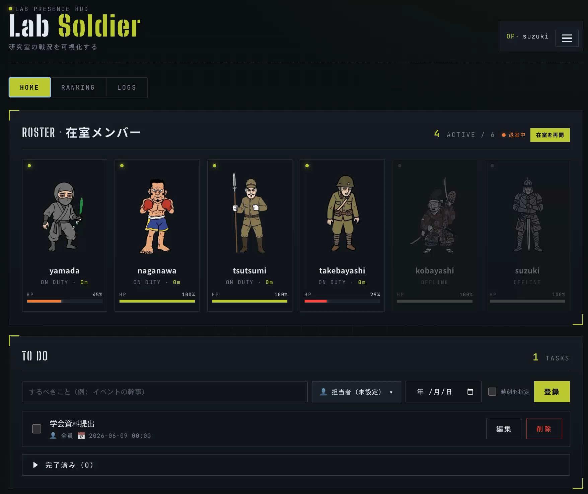
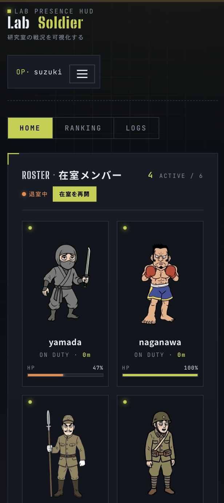
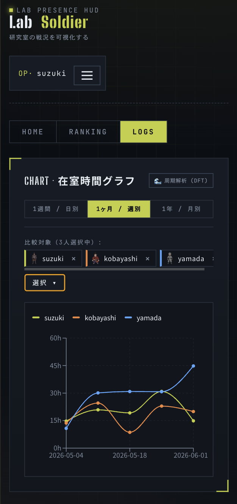
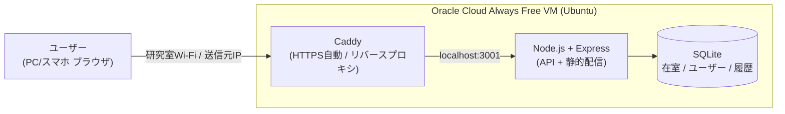

<div align="center">


### 研究室の「いま、だれかいる？」を、兵士キャラで見える化するデジタル在室ボード

[](LICENSE)


<br/>


</div>

> **TL;DR (English)** — LabSoldier visualizes who is currently in the lab as little soldier characters. Presence is detected automatically from **whether your device is on the lab Wi‑Fi** — no GPS, no location data. The longer you stay, the more your soldier wears out (an HP that drains while present and heals while away), and a ranking shows who logs the most hours. Built as a PWA with React + TypeScript on the front and Node.js + Express + SQLite on the back, deployed to a free Oracle Cloud VM behind Caddy (auto‑HTTPS).

---

## 📖 これは何？

「研究室、今だれかいる？」——その一言を送る前に、画面を見れば分かる。
LabSoldier は、研究室にいるメンバーを **兵士キャラクター** で一覧表示する、デジタル版の "在室ボード（行き先表示板）" です。

- 操作は不要。**研究室のWi‑Fiにつながると自動で「在室」** に切り替わります。
- 長く居るほどキャラは少しずつ疲れていき（HP）、よく来る人がランキング上位に。
- 「誰かいる」が見えるだけで、研究室に行く理由になる。無駄足も減る。

<div align="center">

| 🏠 ホーム（在室＋TODO） | 🏆 ランキング | 📈 在室ログ＆DFT |
|:---:|:---:|:---:|
|  |  |  |

<sub>📱 スマホでも同じ画面（PWA・ホーム画面に追加可能）</sub>

&nbsp;&nbsp;


</div>

---

## 💡 背景・モチベーション

研究室には、よくある2つの困りごとがあります。

1. **誰がいるのか分からない。** 行ってみたら誰もいなかった、「今いる？」とLINEで確認し合う——そんな無駄足や手間が積み重なります。
2. **一人だと足が向かない。** でも「誰かいる」と分かれば、研究室に行く気になれます。

LabSoldier は、この2つを「**今、研究室に誰がいるか**」をひと目で分かるようにして解決します。在室しているかどうかは自動で判定されるので、面倒な操作は一切不要。黒板の行き先表示板を、もっと楽しく・もっと自動にしたもの——そんなイメージです。

---

## ✨ 主な機能

| 機能 | 説明 |
|---|---|
| 🛜 **Wi‑Fiで自動在室判定** | クライアントの送信元IPが研究室のものかをサーバーで照合。チェックイン操作は不要。GPS・位置情報は一切使わない。 |
| 🪖 **育って疲れるソルジャー** | 在室で消耗し不在で回復する HP を持ち、HP・在室状況に応じて見た目が **6段階** に変化（元気→長時間在室→深夜→疲労→ダウン→…）。アバターは6種類。 |
| 🏆 **在室ランキング** | 週／月／全期間の在室時間ランキング。「誰が一番こもっているか」が一目で分かる。 |
| 📈 **在室ログ＆グラフ** | 在室履歴の折れ線グラフに加え、**離散フーリエ変換(DFT)** で「曜日の周期性（毎週この曜日に来る）」を可視化。 |
| ✅ **やることリスト** | 研究室共有のTODO。担当者（在室メンバーから複数選択）・期限つき。 |
| 📱 **PWA対応** | スマホのホーム画面に追加してアプリのように使える。 |
| 🛠 **管理者機能** | ユーザー管理・在室ログの追加/削除など。 |
| 🚪 **手動チェックイン/退室** | 自動判定に加え、明示的な退室・復帰も可能。 |

---

## 🪖 ソルジャーたち

アバターは6種類。在室時間とHPに応じて、それぞれが少しずつ疲れていきます。

<div align="center">


</div>

### 在室するほど消耗していく（見た目の段階変化）

<div align="center">


<sub>元気 → 気合い十分 → 疲労 → ダウン → 限界突破</sub>

</div>

---

## 🏗 アーキテクチャ



- **フロント**: React + TypeScript（Vite / PWA）。ビルド成果物は Caddy/Express が同一オリジンで配信。
- **在室判定**: 届いた送信元IPが研究室の公開IPと一致するかで判定（＝GPS不使用）。
- **永続データ**: SQLite の DB ファイルは再デプロイの同期対象外ディレクトリに置き、コード更新で消えないよう分離。
- ER図は [`docs/er-diagram.png`](docs/er-diagram.png)、詳細仕様は [`docs/SPEC.md`](docs/SPEC.md) を参照。

---

## 🛜 在室判定のしくみ

操作は一切不要。ブラウザを開いておくだけで、1分ごとにサーバーが「送信元IPが研究室のものか」だけを見て在室を判定します。

<div align="center">


</div>

1. フロントが**ログイン中1分ごと**に `POST /api/presence/ping`（[`frontend/src/hooks/usePresencePing.ts`](frontend/src/hooks/usePresencePing.ts)）
2. バックエンドが**送信元IP**を取得（`x-forwarded-for` 優先＝Caddy越し対応）
3. 環境変数 `LAB_ALLOWED_IPS`（カンマ区切り）に含まれれば在室、なければ不在
4. 直近の ping 状況から、表示用に **3状態** を判定（[`backend/src/lib/judge.ts`](backend/src/lib/judge.ts)）

| status | 条件 |
| :--- | :--- |
| 🟢 `present` | 退室フラグなし & 5分以内に ping & 在室 |
| 🟡 `unknown` | 5〜30分 ping なし（離席かも） |
| ⚫️ `absent` | 30分以上 ping なし / 退室フラグON / 初期状態 |

> 「退室する」を押すと `manual_off=true` になり以降の ping を無視（勝手に在室復帰しない）。「在室を再開」で自動判定に戻ります。

---

## 🧮 HP・見た目のアルゴリズム

キャラの "疲れ具合" は HP（0〜100%）で表現します。

- **消耗**: 在室中は `24時間で 100% → 0%`（約 0.069%/分）でドレイン
- **回復**: 不在中は `10時間で 0% → 100%`（約 0.167%/分）でヒール
- HP は過去の在室ログを古い順に再生して算出（夜間など長い不在で全回復する）

見た目の **段階(1〜6)** は HP を軸に決定します。

| 段階 | 条件 | イメージ |
|:---:|---|---|
| 1 | HP > 50 | 元気 |
| 2 | HP > 50 かつ 連続在室 3時間以上 | 気合い十分 |
| 3 | 0 < HP ≤ 50 かつ 深夜(JST 1:00–4:00)に在室 | 夜更かし |
| 4 | 0 < HP ≤ 50 | 疲労 |
| 5 | HP = 0 | ダウン |
| 6 | HP = 0 が 4時間以上継続して在室 | 限界突破 |

ロジックは [`backend/src/lib/hp.ts`](backend/src/lib/hp.ts) / [`backend/src/lib/stage.ts`](backend/src/lib/stage.ts) / [`backend/src/lib/judge.ts`](backend/src/lib/judge.ts) にあります。

---

## 🧰 技術スタック

| カテゴリ | 技術 |
| --- | --- |
| フレームワーク | React 18, TypeScript |
| ビルド / 開発サーバー | Vite 5 |
| PWA | vite-plugin-pwa（Service Worker / ホーム画面追加） |
| グラフ | Recharts |
| バックエンド | Node.js 20, Express 4, TypeScript（tsx） |
| データベース | SQLite（better-sqlite3 / 同期API） |
| 認証 | 自前JWT（HS256署名・7日有効）+ scrypt（Node標準 crypto） |
| ホスティング | Oracle Cloud Always Free VM（Ubuntu 22.04 / 1 OCPU / 1GB） |
| プロセス管理 | systemd（常駐・自動再起動） |
| HTTPS / リバースプロキシ | Caddy 2（Let's Encrypt 自動取得） |
| DNS | sslip.io（`<IP>.sslip.io` で独自ドメイン不要） |

---

## 🗄 データモデル

SQLite の3テーブル。`users` を中心に、`presence`（現在の状態・1対1）と `presence_logs`（在室履歴・1対多）で構成します。ランキングと HP はすべて `presence_logs` から算出します。

| テーブル | 役割 | 主なカラム |
| --- | --- | --- |
| `users` | ユーザー台帳 | `id` / `name` / `password_hash`（scrypt）/ `avatar_id` |
| `presence` | 各ユーザーの「今」の状態（1人1行） | `is_present` / `source`（wifi/manual）/ `entered_at` / `last_seen_at` / `manual_off` |
| `presence_logs` | 滞在ごとの履歴（1滞在1行） | `user_id` / `entered_at` / `left_at` / `duration_sec` |

```
users (1) ──── (1) presence        … 各ユーザーの「今」の状態
users (1) ──── (N) presence_logs    … 各ユーザーの滞在履歴（ランキング / HP の元）
```

<div align="center">


</div>

詳細は [`docs/SPEC.md`](docs/SPEC.md) を参照。

---

## 🔌 API 一覧

すべて JSON。認証が要るものは `Authorization: Bearer <token>` ヘッダが必須です。

| Method | Path | 認証 | 説明 |
| --- | --- | :---: | --- |
| `GET` | `/api/health` | – | 死活確認 |
| `POST` | `/api/auth/login` | – | `name` + `password` → user + token |
| `POST` | `/api/auth/signup` | – | `name` + `password` + `avatarId` → user + token |
| `GET` | `/api/auth/me` | ✅ | token から自分の情報 |
| `POST` | `/api/presence/ping` | ✅ | IP判定で在室更新（退室中はスキップ） |
| `POST` | `/api/presence/leave` | ✅ | 明示的に退室（`manual_off=true`） |
| `POST` | `/api/presence/resume` | ✅ | 退室解除（自動判定を再開） |
| `GET` | `/api/presence` | ✅ | 在室者一覧（status / hp / elapsedMin 付き） |
| `GET` | `/api/stats/ranking` | ✅ | 在室時間ランキング（週 / 月 / 全期間） |
| `GET` | `/api/logs` | ✅ | 在室履歴（ユーザー / 期間で絞込み可） |

---

## 🔐 認証フロー

```
[signup / login]  name + password
   → scrypt（salt付き・timingSafeEqual）でハッシュ照合
   → HS256署名の JWT を発行（7日有効）
   → フロントは localStorage に token / user を保管
[以降のAPI]  Authorization: Bearer <token>
   → middleware/auth.ts が署名・期限を検証して User を復元
```

- 公開用 `User` 型と内部用 `AuthUserRecord`（`passwordHash` 付き）を分離し、漏洩を型で防止。
- token署名鍵は環境変数 `JWT_SECRET`（本番で未設定なら起動を停止）。

---

## 📂 ディレクトリ構成

```
.
├── frontend/        # React + TypeScript (Vite / PWA)
│   ├── src/         # 画面・コンポーネント・APIクライアント
│   └── public/      # アイコン・キャラGIF (avatars/<id>/<id>_1..6.gif)
├── backend/         # Node.js + Express + SQLite
│   └── src/         # routes / lib(HP・stage・judge) / db / middleware
├── deploy/          # Caddyfile / systemd unit / セットアップ・再デプロイ スクリプト
├── docs/            # 仕様書(SPEC.md) / ER図 / バックエンド構成 / スクリーンショット
└── README.md
```

---

## 🚀 セットアップ（ローカル開発）

前提: **Node.js 20+** / **npm 10+**

```bash
# 1) バックエンド（http://localhost:3001）
cd backend
npm install
npm run dev

# 2) フロントエンド（http://localhost:5173） ※別ターミナル
cd frontend
npm install
npm run dev
```

ブラウザで http://localhost:5173 を開く。開発用の初期アカウント（`user1` 等 / パスワードは開発用デフォルト）でログインできます。環境変数は [`backend/.env.example`](backend/.env.example) を参照してください。

ビルド:

```bash
cd backend  && npm run build && npm start   # 本番起動
cd frontend && npm run build                # 静的成果物を生成
```

---

## ☁️ 本番デプロイ（概要）

無料の Oracle Cloud Always Free VM 1台に、HTTPS まで自前で構築する想定です。

1. VM 初期セットアップ（Node.js / ビルド / systemd 登録）: [`deploy/setup.sh`](deploy/setup.sh)
2. リバースプロキシ＋自動HTTPS: [`deploy/Caddyfile`](deploy/Caddyfile)（`sslip.io` でドメイン購入不要）
3. 常駐化: [`deploy/labsoldier.service`](deploy/labsoldier.service)（systemd）
4. 更新デプロイ: [`deploy/redeploy.sh`](deploy/redeploy.sh)（`VM_IP` / `SSH_KEY` を環境変数で指定）

環境変数テンプレートは [`deploy/labsoldier.env.example`](deploy/labsoldier.env.example)。**永続データ（DB・env）は同期対象外のディレクトリに置き**、コード再デプロイ（`rsync --delete`）で消えないようにしています。

---

## 🔒 プライバシー設計

LabSoldier は **位置情報・GPSを一切使いません**。サーバーが見るのは「送信元IPが研究室のWi‑Fiのものか」という1ビットだけ。

- 地図はなく、個人の "居場所" は分かりません。
- 研究室の外にいる間は、誰にも何も見えません。
- "個人を追う" のではなく、"部屋の状況" を見るためのツールです。

---

## 🧭 規模・既知の課題

想定規模は研究室メンバー（数人〜数十人）。SQLite + 小型VMで十分で、在室ログは年間でも数MB程度です。一方、不特定多数への本格公開には以下の対応が必要です。

- 初期メンバーは開発用の共通パスワード（要・初回変更フロー）。
- ログイン試行のレート制限なし（総当たり対策）。
- 研究室の公開IPが変動するとWi-Fi判定が崩れる（実機で実IPを確認・調整して運用）。
- VMが Always Free 枠のため、長期アイドルで停止されうる（コンソールから復帰可・データは保持）。

---

## 📄 ライセンス

[MIT License](LICENSE) © 2026 daiki-pyonkichi

> 本リポジトリはハッカソンで制作したアプリを、ポートフォリオ用に整形・公開したものです。
